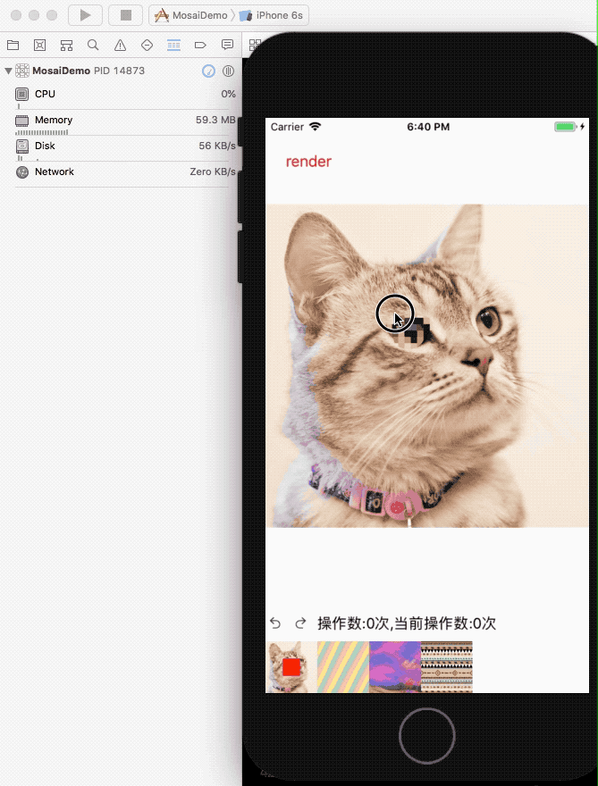

# iOS 马赛克画笔

在图片上用手指涂抹，显示马赛克效果。支持多种马赛克样式、撤销/重做、画笔大小调节和保存到相册。

## 项目结构

本仓库包含两个版本的实现：

### MosaiDemo（Objective-C 版本）

使用 `CAShapeLayer` + `mask` 实现实时马赛克预览，使用 `Core Graphics` 在每一笔画完之后生成马赛克图。

### MosaicMetal（Swift + Metal 版本）

使用 Metal GPU 渲染管线重写，采用双渲染通道架构：

- **遮罩通道（Mask Pass）**：将画笔圆点渲染到离屏 R8Unorm 纹理，记录涂抹区域
- **合成通道（Composite Pass）**：采样原图 + 遮罩 + 马赛克纹理，合成输出到屏幕

#### 功能

- 像素化马赛克（Fragment Shader 实时计算）
- 3 种图案纹理马赛克样式
- 不同样式可层叠（切换时烘焙当前状态到底图）
- 逐笔撤销/重做（UndoManager + 遮罩纹理快照）
- 画笔大小滑块调节（范围 5-50）
- 图片等比适配显示（Aspect Fit）
- 导出合成结果保存到相册

#### 技术要点

- 使用 `CAMetalLayer` 作为 UIView 的 backing layer（非 MTKView），直接学习 Metal 顶点/着色器处理
- 三条渲染管线：遮罩管线（R8Unorm）、合成管线（BGRA8Unorm）、烘焙管线（RGBA8Unorm）
- Metal Shader 中通过 UV 坐标对齐到像素块中心实现马赛克效果
- GPU 端 Blit 编码器进行纹理快照和拷贝
- CADisplayLink 脏标记驱动渲染，避免无意义的 GPU 开销

详细技术文档请参考 [Metal 技术详解](./MosaicMetal/METAL_GUIDE.md)

## 思路参考

[马赛克画笔思路传送门](http://isylar.com/2018/04/03/iOSMosaiImagePen/)
